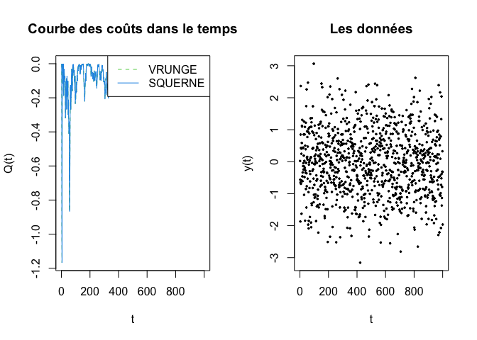
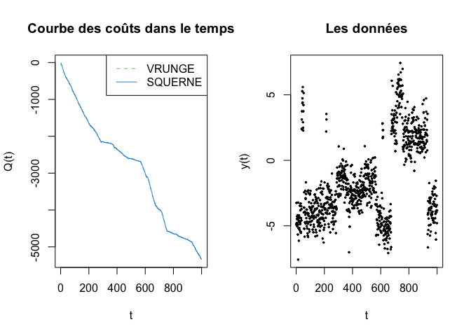
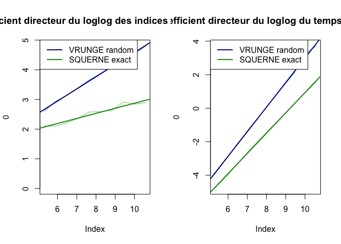
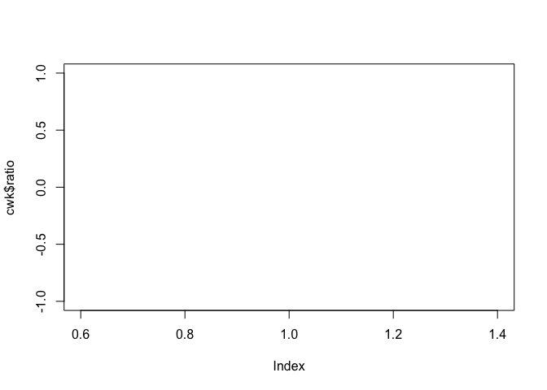

```
## 
## Attaching package: 'dust'
```

```
## The following object is masked from 'package:stats':
## 
##     D
```

```
## The following object is masked from 'package:base':
## 
##     eval
```

```
## 
## Attaching package: 'DUSTpartitioning'
```

```
## The following objects are masked from 'package:dust':
## 
##     dataGenerator_1D, dataGenerator_AR1, dataGenerator_MultiD,
##     dataGenerator_MV, dataGenerator_Reg
```


# Comparaison des couts optimaux


```r
y = rnorm(1e3)
Q.noise = compare_costs(y, F.VR$DUSTr, F.SQ$DUSTx)
```

<!-- -->

```r
Q.changepoints = compare_costs(generate_random_changepoints(1e3, 20, 0, 1, 9)$donnees, F.VR$DUSTr, F.SQ$DUSTx)
```

<!-- -->


# Comparaison des changepoints


```r
fdata = function(f, data) f(data)

compare_changepoints = function(data, OP.VR, OP.SQ, PELT.VR, PELT.SQ, DUST.VR, DUST.SQ) {
  n = length(data)
  
  output = list(
    OP = list(VR = lapply(OP.VR, fdata, data=data), SQ = lapply(OP.SQ, fdata, data=data)),
    PELT = list(VR = lapply(PELT.VR, fdata, data=data), SQ = lapply(PELT.SQ, fdata, data=data)),
    DUST = list(VR = lapply(DUST.VR, fdata, data=data), SQ = lapply(DUST.SQ, fdata, data=data))
  )
  changepoints = lapply(
    output,
    function(method)
      lapply(
        method,
        function(auteur)
          lapply(auteur, function(f) c(0, f$changepoints[f$changepoints > 0]))
      )
  )
  
  for (name in names(changepoints)) {
    par(mfrow = c(2, 1))
    
    current_method = changepoints[[name]]
    n_auteur = vapply(current_method, length, numeric(1))
    
    plot(data, pch = 20, cex = .5, main = 'Les données', xlab = 't', ylab = 'y')
    
    plot(0, type = 'n', axes = FALSE, frame.plot = TRUE, main = paste('Comparaison des changepoints pour la méthode', name), xlab = '', ylab = '', xlim = c(1, n), ylim = c(0, sum(n_auteur)))
    
    if(n_auteur['VR'] > 1) abline(h = seq(1, n_auteur['VR'] - 1))
    abline(h = n_auteur['VR'], lwd = 2)
    if(n_auteur['SQ'] > 1) abline(h = n_auteur['VR'] + seq(1, n_auteur['SQ'] - 1))
    
    col = c(VR = 3, SQ = 4)
    y0 = 0
    y1 = 1
    for (auteur in names(current_method)) {
      changepoint.auteur = current_method[[auteur]]
      for (f in changepoint.auteur) {
        changepoints.f = f
        K = length(changepoints.f)
        segments(x0 = changepoints.f, y0 = rep(y0, K), y1 = rep(y1, K), col = col[auteur])
        
        y0 = y0 + 1
        y1 = y1 + 1
      }
      
    }
  }
}
```


```r
output = compare_changepoints(
  generate_random_changepoints(1e3, 1e3/50, 0, 1, 9)$donnees,
  F.VR['OP'], F.SQ['OP'],
  F.VR['PELT'], F.SQ['PELT'],
  F.VR[c('DUSTr', 'DUSTp')], F.SQ[c('DUSTr', 'DUSTpr', 'DUSTx', 'DUSTpx')]
)
```

<!-- --><!-- --><!-- -->


# Comparaison de runtime


```r
n = 1e3
benchmark(n, F.VR, F.SQ)
```

```
## $VR
##              OP  PELT DUSTr DUSTp
## user.self 0.984 2.034 0.227 0.281
## sys.self  0.002 0.003 0.000 0.001
## elapsed   0.988 2.042 0.228 0.283
## 
## $SQ
##              OP  PELT DUSTx DUSTr DUSTpx DUSTpr
## user.self 0.583 1.392 0.065 0.175  0.065  0.172
## sys.self  0.001 0.056 0.000 0.000  0.000  0.001
## elapsed   0.586 1.452 0.064 0.175  0.065  0.174
```


```r
n = 1e4
benchmark(n, F.VR[3:4], F.SQ[3:6])
```

```
## $VR
##           DUSTr DUSTp
## user.self 6.318 7.451
## sys.self  0.017 0.020
## elapsed   6.352 7.521
## 
## $SQ
##           DUSTx DUSTr DUSTpx DUSTpr
## user.self 1.056 4.461  1.046  4.404
## sys.self  0.002 0.012  0.003  0.010
## elapsed   1.065 4.502  1.057  4.447
```


```r
benchmark(0, F.VR[3:4], F.SQ[3:6], data=generate_random_changepoints(n, n/50, 20, 1, 1)$donnees)
```

```
## $VR
##           DUSTr DUSTp
## user.self 2.453 2.356
## sys.self  0.006 0.003
## elapsed   2.474 2.375
## 
## $SQ
##           DUSTx DUSTr DUSTpx DUSTpr
## user.self 0.950 1.689  0.773  1.424
## sys.self  0.002 0.003  0.001  0.003
## elapsed   0.960 1.704  0.780  1.436
```


# Comparaison des indices non-élagués


```r
n = 1e3
n.index = compare_index(rnorm(n), F.SQ, F.VR, display_fun = log)
```

<!-- -->


```r
mean_time_indices = function(n, k, f, auteur) {
  time_taken = matrix(nrow = k, ncol = 3)
  nb = numeric(k)
  
  if (auteur == 'VR') record = 'nb'
  else record = 'nb_record'
  

  for (i in 1:k) {
    time_taken[i, ] = system.time(tmp_output <- f(rnorm(n)))[1:3]
    print(c(auteur = auteur, n = n, time_taken = time_taken[i, ]))
    nb[i] = tail(tmp_output[[record]], 1)
  }
  return(c(time_taken = mean(time_taken[, 3]), indices = mean(nb)))
}

compare_deg_temps = function(n_max, k, f.VR, f.SQ, K) {
  n_values = floor(n_max ^ seq(.5, 1, length.out = 10))
  
  output.VR = vapply(n_values, mean_time_indices, k = k, f = f.VR, auteur = 'VR', numeric(2))
  output.SQ = vapply(n_values, mean_time_indices, k = k, f = f.SQ, auteur = 'SQ', numeric(2))
  
  t.VR = log(output.VR[1, ])
  n.VR = log(output.VR[2, ])
  t.SQ = log(output.SQ[1, ])
  n.SQ = log(output.SQ[2, ])
  
  x = log(n_values)
  
  mod1 = list(VR = lm(n.VR ~ x), SQ = lm(n.SQ ~ x))
  mod2 = list(VR = lm(t.VR ~ x), SQ = lm(t.SQ ~ x))
  mod1_coef = vapply(mod1, coef, numeric(2))
  mod2_coef = vapply(mod2, coef, numeric(2))
  print(mod1_coef)
  print(mod2_coef)
  
  par(mfrow = c(1, 2))
  
  #### Indices conservés ####
  plot(0, type = 'n', xlim = quantile(x, 0:1), ylim=c(min(min(n.VR, n.SQ), 0), max(n.VR, n.SQ)), main='Coefficient directeur du loglog des indices conservés')
  lines(x, n.VR, col=4)
  lines(x, n.SQ, col=3)
  
  abline(mod1_coef[1, 1], mod1_coef[2, 1], col='navyblue', lwd=2)
  abline(mod1_coef[1, 2], mod1_coef[2, 2], col='forestgreen', lwd=2)
  
  legend('topleft', c('VRUNGE random', 'SQUERNE exact'), col=c('navyblue', 'forestgreen'), lty=c(1, 1), lwd=c(2, 2))
  
  #### Temps écoulé ####
  plot(0, type = 'n', xlim = quantile(x, 0:1), ylim=c(min(min(t.VR, t.SQ), 0), max(t.VR, t.SQ)), main='Coefficient directeur du loglog du temps écoulé')
  lines(x, t.VR, col=4)
  lines(x, t.SQ, col=3)
  
  abline(mod2_coef[1, 1], mod2_coef[2, 1], col='navyblue', lwd=2)
  abline(mod2_coef[1, 2], mod2_coef[2, 2], col='forestgreen', lwd=2)
  
  legend('topleft', c('VRUNGE random', 'SQUERNE exact'), col=c('navyblue', 'forestgreen'), lty=c(1, 1), lwd=c(2, 2))
  
  return(list(n.VR = n.VR, t.VR = t.VR, n.SQ = n.SQ, t.SQ = t.SQ))
}
```


```r
n = 4e4
cmp = compare_deg_temps(n, 10, F.VR$DUSTr, F.SQ$DUSTpx)
```

```
##               auteur                    n          time_taken1 
##                 "VR"                "200" "0.0149999999999935" 
##          time_taken2          time_taken3 
##                  "0" "0.0150000000000006" 
##               auteur                    n          time_taken1 
##                 "VR"                "200" "0.0230000000000032" 
##          time_taken2          time_taken3 
##                  "0" "0.0219999999999985" 
##               auteur                    n          time_taken1 
##                 "VR"                "200" "0.0230000000000032" 
##          time_taken2          time_taken3 
##              "0.001" "0.0239999999999938" 
##               auteur                    n          time_taken1 
##                 "VR"                "200" "0.0180000000000007" 
##          time_taken2          time_taken3 
##                  "0" "0.0189999999999984" 
##               auteur                    n          time_taken1 
##                 "VR"                "200" "0.0189999999999984" 
##          time_taken2          time_taken3 
##                  "0" "0.0200000000000031" 
##               auteur                    n          time_taken1 
##                 "VR"                "200" "0.0150000000000006" 
##          time_taken2          time_taken3 
##                  "0" "0.0150000000000006" 
##               auteur                    n          time_taken1 
##                 "VR"                "200" "0.0210000000000008" 
##          time_taken2          time_taken3 
##                  "0" "0.0200000000000031" 
##               auteur                    n          time_taken1 
##                 "VR"                "200" "0.0189999999999984" 
##          time_taken2          time_taken3 
##                  "0" "0.0200000000000031" 
##               auteur                    n          time_taken1 
##                 "VR"                "200" "0.0169999999999959" 
##          time_taken2          time_taken3 
##                  "0" "0.0180000000000007" 
##               auteur                    n          time_taken1 
##                 "VR"                "200" "0.0200000000000031" 
##          time_taken2          time_taken3 
##                  "0"  "0.019999999999996" 
##               auteur                    n          time_taken1 
##                 "VR"                "360" "0.0530000000000044" 
##          time_taken2          time_taken3 
##                  "0" "0.0529999999999973" 
##               auteur                    n          time_taken1 
##                 "VR"                "360" "0.0459999999999994" 
##          time_taken2          time_taken3 
##                  "0" "0.0470000000000041" 
##               auteur                    n          time_taken1 
##                 "VR"                "360" "0.0470000000000041" 
##          time_taken2          time_taken3 
##              "0.001" "0.0480000000000018" 
##               auteur                    n          time_taken1 
##                 "VR"                "360" "0.0510000000000019" 
##          time_taken2          time_taken3 
##                  "0" "0.0510000000000019" 
##               auteur                    n          time_taken1 
##                 "VR"                "360" "0.0450000000000017" 
##          time_taken2          time_taken3 
##              "0.001" "0.0459999999999994" 
##               auteur                    n          time_taken1 
##                 "VR"                "360" "0.0419999999999945" 
##          time_taken2          time_taken3 
##                  "0" "0.0420000000000016" 
##               auteur                    n          time_taken1 
##                 "VR"                "360" "0.0519999999999996" 
##          time_taken2          time_taken3 
##              "0.001" "0.0530000000000044" 
##               auteur                    n          time_taken1 
##                 "VR"                "360" "0.0489999999999995" 
##          time_taken2          time_taken3 
##                  "0" "0.0489999999999995" 
##               auteur                    n          time_taken1 
##                 "VR"                "360"  "0.044000000000004" 
##          time_taken2          time_taken3 
##                  "0" "0.0449999999999946" 
##               auteur                    n          time_taken1 
##                 "VR"                "360" "0.0429999999999993" 
##          time_taken2          time_taken3 
##              "0.001" "0.0439999999999969" 
##              auteur                   n         time_taken1         time_taken2 
##                "VR"               "649" "0.119999999999997"                 "0" 
##         time_taken3 
## "0.120000000000005" 
##              auteur                   n         time_taken1         time_taken2 
##                "VR"               "649"             "0.119"                 "0" 
##         time_taken3 
## "0.119999999999997" 
##              auteur                   n         time_taken1         time_taken2 
##                "VR"               "649" "0.128999999999998"                 "0" 
##         time_taken3 
## "0.128999999999998" 
##      auteur           n time_taken1 time_taken2 time_taken3 
##        "VR"       "649"     "0.119"     "0.001"     "0.119" 
##              auteur                   n         time_taken1         time_taken2 
##                "VR"               "649" "0.108999999999995"                 "0" 
##         time_taken3 
## "0.109999999999999" 
##      auteur           n time_taken1 time_taken2 time_taken3 
##        "VR"       "649"     "0.113"     "0.001"     "0.113" 
##              auteur                   n         time_taken1         time_taken2 
##                "VR"               "649" "0.117000000000004"                 "0" 
##         time_taken3 
## "0.117000000000004" 
##              auteur                   n         time_taken1         time_taken2 
##                "VR"               "649" "0.116999999999997"                 "0" 
##         time_taken3 
## "0.116999999999997" 
##              auteur                   n         time_taken1         time_taken2 
##                "VR"               "649" "0.109999999999999"                 "0" 
##         time_taken3 
## "0.110999999999997" 
##              auteur                   n         time_taken1         time_taken2 
##                "VR"               "649"             "0.119"                 "0" 
##         time_taken3 
## "0.119999999999997" 
##              auteur                   n         time_taken1         time_taken2 
##                "VR"              "1169" "0.278999999999996"             "0.001" 
##         time_taken3 
## "0.280000000000001" 
##              auteur                   n         time_taken1         time_taken2 
##                "VR"              "1169" "0.292000000000002"             "0.001" 
##         time_taken3 
## "0.292999999999999" 
##              auteur                   n         time_taken1         time_taken2 
##                "VR"              "1169"             "0.302"             "0.001" 
##         time_taken3 
## "0.304000000000002" 
##              auteur                   n         time_taken1         time_taken2 
##                "VR"              "1169" "0.271000000000001"                 "0" 
##         time_taken3 
## "0.271999999999998" 
##              auteur                   n         time_taken1         time_taken2 
##                "VR"              "1169" "0.283999999999999"             "0.001" 
##         time_taken3 
## "0.285000000000004" 
##              auteur                   n         time_taken1         time_taken2 
##                "VR"              "1169" "0.274999999999999"                 "0" 
##         time_taken3 
## "0.276000000000003" 
##              auteur                   n         time_taken1         time_taken2 
##                "VR"              "1169" "0.280999999999999"             "0.002" 
##         time_taken3 
## "0.283000000000001" 
##              auteur                   n         time_taken1         time_taken2 
##                "VR"              "1169" "0.258000000000003"                 "0" 
##         time_taken3 
## "0.258000000000003" 
##              auteur                   n         time_taken1         time_taken2 
##                "VR"              "1169" "0.275999999999996"             "0.001" 
##         time_taken3 
## "0.277999999999999" 
##              auteur                   n         time_taken1         time_taken2 
##                "VR"              "1169" "0.278999999999996"             "0.001" 
##         time_taken3 
## "0.281999999999996" 
##              auteur                   n         time_taken1         time_taken2 
##                "VR"              "2107" "0.660000000000004"             "0.002" 
##         time_taken3 
## "0.667999999999999" 
##      auteur           n time_taken1 time_taken2 time_taken3 
##        "VR"      "2107"     "0.631"     "0.001"     "0.637" 
##              auteur                   n         time_taken1         time_taken2 
##                "VR"              "2107" "0.637999999999998"             "0.001" 
##         time_taken3 
## "0.643000000000001" 
##              auteur                   n         time_taken1         time_taken2 
##                "VR"              "2107" "0.649000000000001"                 "0" 
##         time_taken3 
## "0.654999999999994" 
##              auteur                   n         time_taken1         time_taken2 
##                "VR"              "2107" "0.610000000000007"             "0.001" 
##         time_taken3 
##             "0.616" 
##              auteur                   n         time_taken1         time_taken2 
##                "VR"              "2107" "0.635000000000005"             "0.001" 
##         time_taken3 
## "0.638999999999996" 
##              auteur                   n         time_taken1         time_taken2 
##                "VR"              "2107" "0.655999999999999"             "0.001" 
##         time_taken3 
## "0.661000000000001" 
##              auteur                   n         time_taken1         time_taken2 
##                "VR"              "2107"             "0.674"             "0.002" 
##         time_taken3 
## "0.686999999999998" 
##              auteur                   n         time_taken1         time_taken2 
##                "VR"              "2107" "0.574999999999996"             "0.001" 
##         time_taken3 
## "0.580000000000005" 
##              auteur                   n         time_taken1         time_taken2 
##                "VR"              "2107" "0.658000000000001"             "0.001" 
##         time_taken3 
## "0.661000000000001" 
##             auteur                  n        time_taken1        time_taken2 
##               "VR"             "3796"            "1.555"            "0.004" 
##        time_taken3 
## "1.56399999999999" 
##             auteur                  n        time_taken1        time_taken2 
##               "VR"             "3796"            "1.416"            "0.001" 
##        time_taken3 
## "1.42099999999999" 
##             auteur                  n        time_taken1        time_taken2 
##               "VR"             "3796"            "1.648"            "0.002" 
##        time_taken3 
## "1.65199999999999" 
##             auteur                  n        time_taken1        time_taken2 
##               "VR"             "3796" "1.39400000000001"            "0.002" 
##        time_taken3 
##            "1.402" 
##             auteur                  n        time_taken1        time_taken2 
##               "VR"             "3796" "1.46799999999999"            "0.002" 
##        time_taken3 
## "1.47499999999999" 
##             auteur                  n        time_taken1        time_taken2 
##               "VR"             "3796" "1.47199999999999"            "0.002" 
##        time_taken3 
##             "1.48" 
##      auteur           n time_taken1 time_taken2 time_taken3 
##        "VR"      "3796"     "1.348"     "0.002"     "1.354" 
##             auteur                  n        time_taken1        time_taken2 
##               "VR"             "3796" "1.56200000000001"            "0.002" 
##        time_taken3 
##            "1.572" 
##      auteur           n time_taken1 time_taken2 time_taken3 
##        "VR"      "3796"     "1.488"     "0.001"     "1.494" 
##             auteur                  n        time_taken1        time_taken2 
##               "VR"             "3796" "1.57599999999999"            "0.001" 
##        time_taken3 
##            "1.589" 
##      auteur           n time_taken1 time_taken2 time_taken3 
##        "VR"      "6839"     "3.327"     "0.005"     "3.339" 
##                auteur                     n           time_taken1 
##                  "VR"                "6839"               "3.297" 
##           time_taken2           time_taken3 
## "0.00700000000000001"    "3.31100000000001" 
##                auteur                     n           time_taken1 
##                  "VR"                "6839"    "3.49799999999999" 
##           time_taken2           time_taken3 
## "0.00699999999999995"    "3.52199999999999" 
##                auteur                     n           time_taken1 
##                  "VR"                "6839"    "3.55399999999999" 
##           time_taken2           time_taken3 
## "0.00900000000000001"                "3.58" 
##      auteur           n time_taken1 time_taken2 time_taken3 
##        "VR"      "6839"     "3.452"     "0.005"     "3.473" 
##                auteur                     n           time_taken1 
##                  "VR"                "6839"               "3.294" 
##           time_taken2           time_taken3 
## "0.00700000000000001"    "3.30800000000001" 
##                auteur                     n           time_taken1 
##                  "VR"                "6839"    "3.50099999999999" 
##           time_taken2           time_taken3 
## "0.00900000000000001"               "3.514" 
##             auteur                  n        time_taken1        time_taken2 
##               "VR"             "6839" "3.76499999999999"             "0.01" 
##        time_taken3 
## "3.78700000000001" 
##             auteur                  n        time_taken1        time_taken2 
##               "VR"             "6839" "3.60599999999999"            "0.006" 
##        time_taken3 
##            "3.629" 
##      auteur           n time_taken1 time_taken2 time_taken3 
##        "VR"      "6839"     "3.319"     "0.006"     "3.345" 
##      auteur           n time_taken1 time_taken2 time_taken3 
##        "VR"     "12323"     "7.523"     "0.018"     "7.557" 
##             auteur                  n        time_taken1        time_taken2 
##               "VR"            "12323" "7.79700000000001"            "0.024" 
##        time_taken3 
## "7.84699999999999" 
##             auteur                  n        time_taken1        time_taken2 
##               "VR"            "12323" "8.03800000000001"            "0.019" 
##        time_taken3 
##             "8.12" 
##             auteur                  n        time_taken1        time_taken2 
##               "VR"            "12323" "7.91300000000001"            "0.022" 
##        time_taken3 
## "7.96600000000001" 
##             auteur                  n        time_taken1        time_taken2 
##               "VR"            "12323" "8.28100000000001"            "0.022" 
##        time_taken3 
## "8.34199999999998" 
##             auteur                  n        time_taken1        time_taken2 
##               "VR"            "12323" "7.71799999999999"            "0.021" 
##        time_taken3 
## "7.79299999999998" 
##      auteur           n time_taken1 time_taken2 time_taken3 
##        "VR"     "12323"     "7.733"     "0.024"     "7.792" 
##               auteur                    n          time_taken1 
##                 "VR"              "12323"   "8.06300000000002" 
##          time_taken2          time_taken3 
## "0.0219999999999999"   "8.13900000000001" 
##      auteur           n time_taken1 time_taken2 time_taken3 
##        "VR"     "12323"     "8.154"     "0.021"     "8.226" 
##             auteur                  n        time_taken1        time_taken2 
##               "VR"            "12323" "8.10499999999999"            "0.024" 
##        time_taken3 
##            "8.179" 
##               auteur                    n          time_taken1 
##                 "VR"              "22201"             "18.281" 
##          time_taken2          time_taken3 
## "0.0710000000000001"             "18.426" 
##      auteur           n time_taken1 time_taken2 time_taken3 
##        "VR"     "22201"    "18.867"     "0.069"    "19.002" 
##      auteur           n time_taken1 time_taken2 time_taken3 
##        "VR"     "22201"    "17.587"     "0.059"    "17.746" 
##      auteur           n time_taken1 time_taken2 time_taken3 
##        "VR"     "22201"    "17.529"     "0.068"    "80.137" 
##      auteur           n time_taken1 time_taken2 time_taken3 
##        "VR"     "22201"    "18.741"     "0.071"    "29.158" 
##             auteur                  n        time_taken1        time_taken2 
##               "VR"            "22201"           "17.687"            "0.064" 
##        time_taken3 
## "17.8150000000001" 
##               auteur                    n          time_taken1 
##                 "VR"              "22201"             "18.093" 
##          time_taken2          time_taken3 
## "0.0640000000000001"             "18.225" 
##               auteur                    n          time_taken1 
##                 "VR"              "22201"             "18.172" 
##          time_taken2          time_taken3 
## "0.0640000000000001"             "18.309" 
##               auteur                    n          time_taken1 
##                 "VR"              "22201"             "17.981" 
##          time_taken2          time_taken3 
## "0.0640000000000001"             "18.098" 
##               auteur                    n          time_taken1 
##                 "VR"              "22201"             "17.857" 
##          time_taken2          time_taken3 
## "0.0599999999999998"             "17.965" 
##      auteur           n time_taken1 time_taken2 time_taken3 
##        "VR"     "40000"     "41.55"     "0.177"    "42.014" 
##             auteur                  n        time_taken1        time_taken2 
##               "VR"            "40000"           "41.858"            "0.184" 
##        time_taken3 
## "42.2930000000001" 
##             auteur                  n        time_taken1        time_taken2 
##               "VR"            "40000"           "41.214"             "0.16" 
##        time_taken3 
## "41.5590000000001" 
##             auteur                  n        time_taken1        time_taken2 
##               "VR"            "40000"           "40.705"            "0.162" 
##        time_taken3 
## "41.1279999999999" 
##      auteur           n time_taken1 time_taken2 time_taken3 
##        "VR"     "40000"    "39.691"     "0.139"    "40.073" 
##             auteur                  n        time_taken1        time_taken2 
##               "VR"            "40000"           "41.764"            "0.168" 
##        time_taken3 
## "42.2429999999999" 
##      auteur           n time_taken1 time_taken2 time_taken3 
##        "VR"     "40000"    "42.332"     "0.168"    "42.827" 
##             auteur                  n        time_taken1        time_taken2 
##               "VR"            "40000"           "42.384"            "0.181" 
##        time_taken3 
## "42.8470000000001" 
##      auteur           n time_taken1 time_taken2 time_taken3 
##        "VR"     "40000"    "40.124"     "0.159"    "40.452" 
##      auteur           n time_taken1 time_taken2 time_taken3 
##        "VR"     "40000"    "40.537"     "0.172"    "40.933" 
##                auteur                     n           time_taken1 
##                  "SQ"                 "200" "0.00799999999992451" 
##           time_taken2           time_taken3 
##                   "0" "0.00799999999992451" 
##                auteur                     n           time_taken1 
##                  "SQ"                 "200"  "0.0080000000000382" 
##           time_taken2           time_taken3 
##                   "0" "0.00799999999992451" 
##                auteur                     n           time_taken1 
##                  "SQ"                 "200" "0.00900000000001455" 
##           time_taken2           time_taken3 
##                   "0" "0.00900000000001455" 
##                auteur                     n           time_taken1 
##                  "SQ"                 "200" "0.00799999999992451" 
##           time_taken2           time_taken3 
##                   "0"  "0.0080000000000382" 
##                auteur                     n           time_taken1 
##                  "SQ"                 "200"  "0.0080000000000382" 
##           time_taken2           time_taken3 
##                   "0" "0.00700000000006185" 
##               auteur                    n          time_taken1 
##                 "SQ"                "200" "0.0080000000000382" 
##          time_taken2          time_taken3 
##                  "0" "0.0080000000000382" 
##               auteur                    n          time_taken1 
##                 "SQ"                "200" "0.0099999999999909" 
##          time_taken2          time_taken3 
##                  "0" "0.0099999999999909" 
##                auteur                     n           time_taken1 
##                  "SQ"                 "200" "0.00900000000001455" 
##           time_taken2           time_taken3 
##                   "0" "0.00900000000001455" 
##                auteur                     n           time_taken1 
##                  "SQ"                 "200" "0.00700000000006185" 
##           time_taken2           time_taken3 
##                   "0"  "0.0080000000000382" 
##                auteur                     n           time_taken1 
##                  "SQ"                 "200" "0.00700000000006185" 
##           time_taken2           time_taken3 
##                   "0"  "0.0080000000000382" 
##               auteur                    n          time_taken1 
##                 "SQ"                "360" "0.0160000000000764" 
##          time_taken2          time_taken3 
##                  "0" "0.0169999999999391" 
##                auteur                     n           time_taken1 
##                  "SQ"                 "360"  "0.0180000000000291" 
##           time_taken2           time_taken3 
## "0.00099999999999989"  "0.0180000000000291" 
##               auteur                    n          time_taken1 
##                 "SQ"                "360" "0.0170000000000528" 
##          time_taken2          time_taken3 
##                  "0" "0.0170000000000528" 
##               auteur                    n          time_taken1 
##                 "SQ"                "360" "0.0159999999999627" 
##          time_taken2          time_taken3 
##                  "0" "0.0159999999999627" 
##               auteur                    n          time_taken1 
##                 "SQ"                "360" "0.0149999999999864" 
##          time_taken2          time_taken3 
##                  "0" "0.0149999999999864" 
##               auteur                    n          time_taken1 
##                 "SQ"                "360" "0.0159999999999627" 
##          time_taken2          time_taken3 
##                  "0" "0.0159999999999627" 
##                auteur                     n           time_taken1 
##                  "SQ"                 "360"  "0.0169999999999391" 
##           time_taken2           time_taken3 
## "0.00100000000000033"  "0.0159999999999627" 
##               auteur                    n          time_taken1 
##                 "SQ"                "360" "0.0149999999999864" 
##          time_taken2          time_taken3 
##                  "0"    "0.0150000000001" 
##               auteur                    n          time_taken1 
##                 "SQ"                "360" "0.0169999999999391" 
##          time_taken2          time_taken3 
##                  "0" "0.0180000000000291" 
##               auteur                    n          time_taken1 
##                 "SQ"                "360" "0.0179999999999154" 
##          time_taken2          time_taken3 
##                  "0" "0.0179999999999154" 
##               auteur                    n          time_taken1 
##                 "SQ"                "649" "0.0339999999999918" 
##          time_taken2          time_taken3 
##                  "0" "0.0349999999999682" 
##               auteur                    n          time_taken1 
##                 "SQ"                "649" "0.0339999999999918" 
##          time_taken2          time_taken3 
##                  "0" "0.0339999999999918" 
##                auteur                     n           time_taken1 
##                  "SQ"                 "649"  "0.0380000000000109" 
##           time_taken2           time_taken3 
## "0.00099999999999989"  "0.0399999999999636" 
##               auteur                    n          time_taken1 
##                 "SQ"                "649" "0.0330000000000155" 
##          time_taken2          time_taken3 
##                  "0" "0.0330000000000155" 
##                auteur                     n           time_taken1 
##                  "SQ"                 "649"  "0.0350000000000819" 
##           time_taken2           time_taken3 
## "0.00100000000000033"  "0.0360000000000582" 
##               auteur                    n          time_taken1 
##                 "SQ"                "649" "0.0349999999999682" 
##          time_taken2          time_taken3 
##                  "0" "0.0349999999999682" 
##               auteur                    n          time_taken1 
##                 "SQ"                "649" "0.0330000000000155" 
##          time_taken2          time_taken3 
##                  "0" "0.0339999999999918" 
##               auteur                    n          time_taken1 
##                 "SQ"                "649" "0.0320000000000391" 
##          time_taken2          time_taken3 
##                  "0" "0.0320000000000391" 
##                auteur                     n           time_taken1 
##                  "SQ"                 "649"  "0.0339999999999918" 
##           time_taken2           time_taken3 
## "0.00099999999999989"  "0.0349999999999682" 
##               auteur                    n          time_taken1 
##                 "SQ"                "649" "0.0360000000000582" 
##          time_taken2          time_taken3 
##                  "0" "0.0360000000000582" 
##               auteur                    n          time_taken1 
##                 "SQ"               "1169"   "0.07000000000005" 
##          time_taken2          time_taken3 
##                  "0" "0.0699999999999363" 
##                auteur                     n           time_taken1 
##                  "SQ"                "1169"  "0.0760000000000218" 
##           time_taken2           time_taken3 
## "0.00099999999999989"    "0.08299999999997" 
##               auteur                    n          time_taken1 
##                 "SQ"               "1169" "0.0679999999999836" 
##          time_taken2          time_taken3 
##                  "0"   "0.06899999999996" 
##                auteur                     n           time_taken1 
##                  "SQ"                "1169"  "0.0780000000000882" 
##           time_taken2           time_taken3 
## "0.00099999999999989"  "0.0779999999999745" 
##             auteur                  n        time_taken1        time_taken2 
##               "SQ"             "1169" "0.07000000000005"                "0" 
##        time_taken3 
## "0.07000000000005" 
##                auteur                     n           time_taken1 
##                  "SQ"                "1169"  "0.0699999999999363" 
##           time_taken2           time_taken3 
## "0.00099999999999989"  "0.0710000000000264" 
##               auteur                    n          time_taken1 
##                 "SQ"               "1169"   "0.08299999999997" 
##          time_taken2          time_taken3 
##                  "0" "0.0839999999999463" 
##               auteur                    n          time_taken1 
##                 "SQ"               "1169" "0.0979999999999563" 
##          time_taken2          time_taken3 
##                  "0" "0.0989999999999327" 
##                auteur                     n           time_taken1 
##                  "SQ"                "1169"  "0.0720000000000027" 
##           time_taken2           time_taken3 
## "0.00099999999999989"  "0.0729999999999791" 
##               auteur                    n          time_taken1 
##                 "SQ"               "1169" "0.0710000000000264" 
##          time_taken2          time_taken3 
##                  "0" "0.0709999999999127" 
##                auteur                     n           time_taken1 
##                  "SQ"                "2107"   "0.148000000000025" 
##           time_taken2           time_taken3 
## "0.00099999999999989"   "0.148000000000025" 
##              auteur                   n         time_taken1         time_taken2 
##                "SQ"              "2107" "0.149999999999977"                 "0" 
##         time_taken3 
## "0.150000000000091" 
##              auteur                   n         time_taken1         time_taken2 
##                "SQ"              "2107" "0.152000000000044"                 "0" 
##         time_taken3 
##  "0.15300000000002" 
##              auteur                   n         time_taken1         time_taken2 
##                "SQ"              "2107" "0.189000000000078"                 "0" 
##         time_taken3 
## "0.190999999999917" 
##              auteur                   n         time_taken1         time_taken2 
##                "SQ"              "2107" "0.144999999999982"                 "0" 
##         time_taken3 
## "0.144999999999982" 
##                auteur                     n           time_taken1 
##                  "SQ"                "2107"    "0.15199999999993" 
##           time_taken2           time_taken3 
## "0.00099999999999989"    "0.15199999999993" 
##              auteur                   n         time_taken1         time_taken2 
##                "SQ"              "2107" "0.155999999999949"                 "0" 
##         time_taken3 
## "0.157000000000039" 
##              auteur                   n         time_taken1         time_taken2 
##                "SQ"              "2107" "0.148000000000025"                 "0" 
##         time_taken3 
## "0.148000000000025" 
##              auteur                   n         time_taken1         time_taken2 
##                "SQ"              "2107" "0.154999999999973"                 "0" 
##         time_taken3 
## "0.157000000000039" 
##              auteur                   n         time_taken1         time_taken2 
##                "SQ"              "2107" "0.168999999999983"                 "0" 
##         time_taken3 
## "0.170000000000073" 
##                auteur                     n           time_taken1 
##                  "SQ"                "3796"   "0.331000000000017" 
##           time_taken2           time_taken3 
## "0.00199999999999978"   "0.333000000000084" 
##              auteur                   n         time_taken1         time_taken2 
##                "SQ"              "3796" "0.287999999999897"                 "0" 
##         time_taken3 
## "0.288999999999987" 
##                auteur                     n           time_taken1 
##                  "SQ"                "3796"   "0.316000000000031" 
##           time_taken2           time_taken3 
## "0.00100000000000033"   "0.317000000000007" 
##                auteur                     n           time_taken1 
##                  "SQ"                "3796"    "0.32000000000005" 
##           time_taken2           time_taken3 
## "0.00099999999999989"   "0.322000000000003" 
##              auteur                   n         time_taken1         time_taken2 
##                "SQ"              "3796" "0.296000000000049"                 "0" 
##         time_taken3 
## "0.298000000000002" 
##                auteur                     n           time_taken1 
##                  "SQ"                "3796"   "0.312000000000012" 
##           time_taken2           time_taken3 
## "0.00100000000000033"   "0.314000000000078" 
##              auteur                   n         time_taken1         time_taken2 
##                "SQ"              "3796" "0.321000000000026"                 "0" 
##         time_taken3 
## "0.322000000000003" 
##                auteur                     n           time_taken1 
##                  "SQ"                "3796"   "0.302999999999997" 
##           time_taken2           time_taken3 
## "0.00099999999999989"   "0.303999999999974" 
##              auteur                   n         time_taken1         time_taken2 
##                "SQ"              "3796" "0.341999999999985"                 "0" 
##         time_taken3 
## "0.342999999999961" 
##                auteur                     n           time_taken1 
##                  "SQ"                "3796"    "0.30600000000004" 
##           time_taken2           time_taken3 
## "0.00099999999999989"   "0.307999999999993" 
##                auteur                     n           time_taken1 
##                  "SQ"                "6839"   "0.571000000000026" 
##           time_taken2           time_taken3 
## "0.00099999999999989"   "0.574000000000069" 
##                auteur                     n           time_taken1 
##                  "SQ"                "6839"   "0.659999999999968" 
##           time_taken2           time_taken3 
## "0.00100000000000033"   "0.662999999999897" 
##                auteur                     n           time_taken1 
##                  "SQ"                "6839"   "0.613999999999919" 
##           time_taken2           time_taken3 
## "0.00099999999999989"   "0.615999999999985" 
##                auteur                     n           time_taken1 
##                  "SQ"                "6839"   "0.668999999999983" 
##           time_taken2           time_taken3 
## "0.00200000000000022"   "0.673999999999978" 
##                auteur                     n           time_taken1 
##                  "SQ"                "6839"   "0.595000000000027" 
##           time_taken2           time_taken3 
## "0.00099999999999989"    "0.59800000000007" 
##                auteur                     n           time_taken1 
##                  "SQ"                "6839"   "0.646999999999935" 
##           time_taken2           time_taken3 
## "0.00099999999999989"   "0.649999999999977" 
##                auteur                     n           time_taken1 
##                  "SQ"                "6839"   "0.607999999999947" 
##           time_taken2           time_taken3 
## "0.00099999999999989"    "0.61099999999999" 
##              auteur                   n         time_taken1         time_taken2 
##                "SQ"              "6839" "0.600000000000023"                 "0" 
##         time_taken3 
## "0.600999999999999" 
##              auteur                   n         time_taken1         time_taken2 
##                "SQ"              "6839" "0.651000000000067"                 "0" 
##         time_taken3 
## "0.653999999999996" 
##                auteur                     n           time_taken1 
##                  "SQ"                "6839"    "0.59699999999998" 
##           time_taken2           time_taken3 
## "0.00199999999999978"   "0.600000000000023" 
##                auteur                     n           time_taken1 
##                  "SQ"               "12323"    "1.25900000000001" 
##           time_taken2           time_taken3 
## "0.00100000000000033"    "1.26400000000001" 
##                auteur                     n           time_taken1 
##                  "SQ"               "12323"    "1.30700000000002" 
##           time_taken2           time_taken3 
## "0.00300000000000011"    "1.31200000000001" 
##                auteur                     n           time_taken1 
##                  "SQ"               "12323"    "1.20299999999997" 
##           time_taken2           time_taken3 
## "0.00199999999999978"    "1.20699999999999" 
##                auteur                     n           time_taken1 
##                  "SQ"               "12323"    "1.24599999999998" 
##           time_taken2           time_taken3 
## "0.00200000000000022"                "1.25" 
##                auteur                     n           time_taken1 
##                  "SQ"               "12323"               "1.274" 
##           time_taken2           time_taken3 
## "0.00300000000000011"    "1.27999999999997" 
##                auteur                     n           time_taken1 
##                  "SQ"               "12323"    "1.35900000000004" 
##           time_taken2           time_taken3 
## "0.00299999999999967"    "1.36500000000001" 
##                auteur                     n           time_taken1 
##                  "SQ"               "12323"    "1.20699999999999" 
##           time_taken2           time_taken3 
## "0.00300000000000011"    "1.21300000000008" 
##                auteur                     n           time_taken1 
##                  "SQ"               "12323"    "1.19799999999998" 
##           time_taken2           time_taken3 
## "0.00099999999999989"               "1.202" 
##                auteur                     n           time_taken1 
##                  "SQ"               "12323"    "1.40300000000002" 
##           time_taken2           time_taken3 
## "0.00199999999999978"    "1.40800000000002" 
##                auteur                     n           time_taken1 
##                  "SQ"               "12323"    "1.28800000000001" 
##           time_taken2           time_taken3 
## "0.00200000000000022"    "1.29300000000001" 
##                auteur                     n           time_taken1 
##                  "SQ"               "22201"                "2.38" 
##           time_taken2           time_taken3 
## "0.00300000000000011"    "2.38900000000001" 
##                auteur                     n           time_taken1 
##                  "SQ"               "22201"    "2.35300000000007" 
##           time_taken2           time_taken3 
## "0.00299999999999967"    "2.36299999999994" 
##             auteur                  n        time_taken1        time_taken2 
##               "SQ"            "22201" "2.50600000000009"            "0.004" 
##        time_taken3 
## "2.51499999999999" 
##             auteur                  n        time_taken1        time_taken2 
##               "SQ"            "22201" "2.70900000000006"            "0.004" 
##        time_taken3 
## "2.72000000000003" 
##                auteur                     n           time_taken1 
##                  "SQ"               "22201"               "2.577" 
##           time_taken2           time_taken3 
## "0.00299999999999967"    "2.58600000000001" 
##                auteur                     n           time_taken1 
##                  "SQ"               "22201"    "2.48299999999995" 
##           time_taken2           time_taken3 
## "0.00500000000000034"    "2.49400000000003" 
##                auteur                     n           time_taken1 
##                  "SQ"               "22201"    "2.46500000000003" 
##           time_taken2           time_taken3 
## "0.00299999999999967"    "2.47399999999993" 
##             auteur                  n        time_taken1        time_taken2 
##               "SQ"            "22201" "2.43600000000004"            "0.004" 
##        time_taken3 
## "2.44600000000003" 
##             auteur                  n        time_taken1        time_taken2 
##               "SQ"            "22201" "2.53699999999992"            "0.004" 
##        time_taken3 
##            "2.548" 
##                auteur                     n           time_taken1 
##                  "SQ"               "22201"    "2.42100000000005" 
##           time_taken2           time_taken3 
## "0.00300000000000011"    "2.42999999999995" 
##                auteur                     n           time_taken1 
##                  "SQ"               "40000"    "4.86900000000003" 
##           time_taken2           time_taken3 
## "0.00700000000000012"    "4.88699999999994" 
##                auteur                     n           time_taken1 
##                  "SQ"               "40000"    "4.76400000000001" 
##           time_taken2           time_taken3 
## "0.00800000000000001"    "4.78399999999999" 
##                auteur                     n           time_taken1 
##                  "SQ"               "40000"    "5.11400000000003" 
##           time_taken2           time_taken3 
## "0.00700000000000012"    "5.13300000000004" 
##                auteur                     n           time_taken1 
##                  "SQ"               "40000"    "4.71199999999999" 
##           time_taken2           time_taken3 
## "0.00699999999999967"     "4.7299999999999" 
##                auteur                     n           time_taken1 
##                  "SQ"               "40000"    "5.18099999999993" 
##           time_taken2           time_taken3 
## "0.00700000000000012"    "5.20600000000002" 
##                auteur                     n           time_taken1 
##                  "SQ"               "40000"    "4.86300000000006" 
##           time_taken2           time_taken3 
## "0.00700000000000012"    "4.88199999999995" 
##                auteur                     n           time_taken1 
##                  "SQ"               "40000"    "4.72500000000002" 
##           time_taken2           time_taken3 
## "0.00700000000000012"    "4.74300000000005" 
##                auteur                     n           time_taken1 
##                  "SQ"               "40000"    "4.85699999999997" 
##           time_taken2           time_taken3 
## "0.00599999999999978"    "4.87400000000002" 
##                auteur                     n           time_taken1 
##                  "SQ"               "40000"    "4.99400000000003" 
##           time_taken2           time_taken3 
## "0.00700000000000012"    "5.01300000000003" 
##                auteur                     n           time_taken1 
##                  "SQ"               "40000"    "4.98400000000004" 
##           time_taken2           time_taken3 
## "0.00800000000000001"    "5.00299999999993" 
##                    VR        SQ
## (Intercept) 0.4887468 1.1659454
## x           0.4095358 0.1707101
##                     VR         SQ
## (Intercept) -11.674205 -11.168940
## x             1.467226   1.209961
```

<!-- -->

```r
#write.csv(data.frame(lapply(cmp, function(l) {names(l) = log(n ^ seq(.5, 1, length.out = 10)) ; return(l)})), 'sauvegarde_log.csv')
```


```r
#read.csv('sauvegarde_log.csv')
```


# Comparaison du taux d'opérations réalisées par rapport à OP


```r
cwk = compare_work(rnorm(1e4), F.VR$DUSTr, F.SQ$DUSTx, K = 1)
plot(cwk$ratio, type='l')
```

<!-- -->


```r
cwk$abs
```

```
##            100%
## VR 0.0007523385
## SQ 0.0000000000
```

